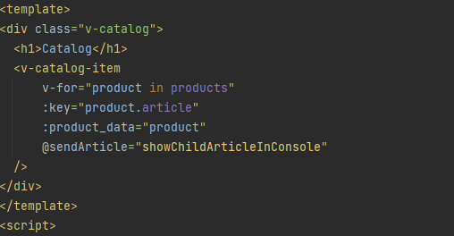
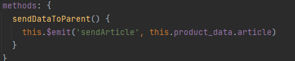
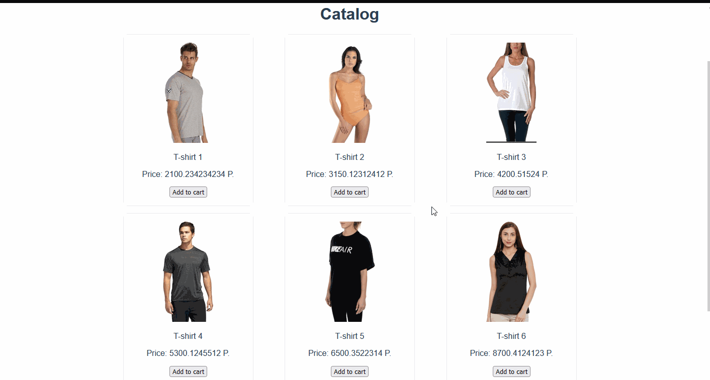
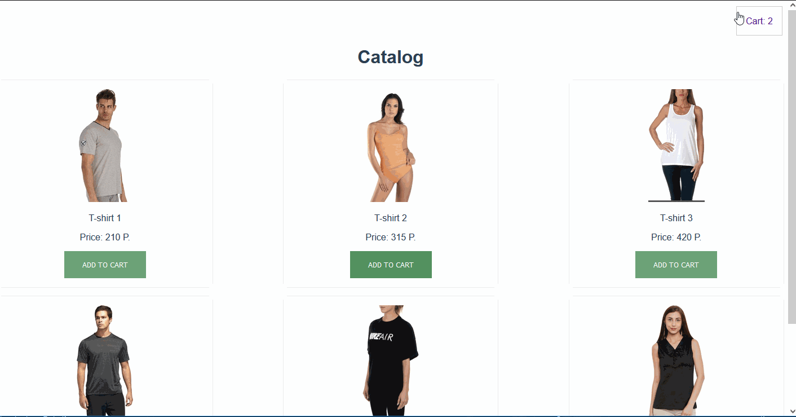

# Vue магазин
## Урок первый
Знакомсвто с vue. Иду по стопам видео, где обещается сделать интрент магазин.
Нового за урок я узнал:

- axios - тот же ajax, но видимо лучше
- json-serve - установлен глобально, дает фейковый АПИ

В самом vue уже есть babel eslint, видимо где то встроен hot module,
хотя если припомнить, то во ve сидит виртуальное DOM дерево,
 а это вроде как лучше обычной проверки hot модуля.

Поставили сразу препорцессоры sass

## Урок второй
За второй урок я увидел базовые вложения родителей и детей,
 заодно познакомили с vue devtools(его основу, видно теперь степень вложенность компонентов).
 Важно понимать, что детей импортируют к родителям, потом указываеют явно в компонентах их имена и
 наконец встраивают самозакрывающимся тегом в html родителя.

## Урок третий
На третьем уроке мы познакомились с v-for и v-bind, создали циклом элементы карточек товара,
 связали данные родителя к детям, и излучили данные детей обратно родителю для работы с ними.

### Код для отображения детей

### Код самого ребенка и его обратное излучение(emit) данных

### Демо результата

 Из важного стоит отметить require метод в :src пути для адекватного отображения картинок

 

## Урок четвертый
Данный урок дался очень тяжело, нас познакомили с Vuex, впервые сталкиваемся с мутаторами, действиями, статикой и геттерами, их принцип взаимодействия для 
меня запутан и не поддается пониманию, просто копипастить идею не даст эффективных результатов, продвижение к интеренет магазину приотсанавливается, будет открыта новая ветка vuex_test для детального изучения. 

## Урок пятый
Изучив видео с Минином, понимание немного пришло, все раво немного путанно, но прослеживать логику, хотя бы основную стало выполнимо,
больше путает синтаксис, но это дело практики, на пятом уроке мы научились обрабатывать положенные в корзину карточки, переносить их эмитом,
и также переносить их родителем посредником, я все еще в приятном удивлении над скоростью работы программы, и сочентания компонентов.
Видно, что в будщем разбравшись со структурностью, можно будет делать многие сложные вещи простым языком. Так как само видео
рассказывает нам на vue 2, то моментами наталкиваются сложности, как напрмер невозможность использовать
this.$set, пришлось догадываться до мутатора и добавлять уже в нем новое поле для наших данных. Ну та то он и мутатор)
Кстати, более подробно у мутатора разобрали условия, что тоже стоит иметь на заметку.

 

## Заключение
Из-за обстоятельств мне пришлось просмотреть оставшиеся видео вне домаЮ ознакомиться с хранилищами поближе, их взаимодействиями,
эмитами, после просмотра пытался сам на понимании и памяти написать код, но я только ходил вокруг, забыл про computed, и про его вычислительые особенности,
в целом этот небольшой курс, пусть и резко, но ознакомил меня с router, vuex и vuejs, конечно еще много чего не понятно, следующей веткой я пройдуйсь углубленно
по vue js 3 по видео Минина. Потом по плану начну свой проект.

И вот результат уроков

 
