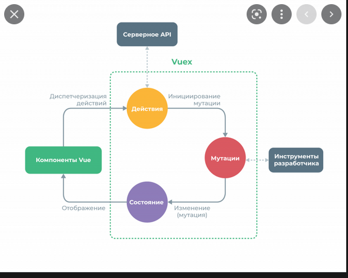

# Знакомство с vuex
Нормально обьясняющих видео или статей нет, видимо я что-то перепрыгнул. Стоит разузнать, где еще применяются мутаторы.

## Нашел видео Минина:
- Есть jsonpalceholder который помогает тестировать взаимодействие backend`a:
https://jsonplaceholder.typicode.com/posts?_limit=num , где num наше число постов, котрые мы хотим получить._limit

видимо это самая понятная схема в интеренете о работе с vuex

## Просморел Минина.
Стала немного яснее взаимосвязь. Геттеры нужны только для того, чтобы вытаскивать уже из готового хранилища данные.
Сами геттеры можно строить по разному для разных фильтраций данных.

Действия используются один раз, чтобы достать из "backend`а" данные и записать их в хранилище, но действие не работает напрямую с хранилищем
нужно обьявиться коммит, то есть задействовать мутатор. У нас в проекте есть два мутатора. Один записывает в хранилище полученную информацию,
другой добавляет к полю хранилища, который массив, элемент.

Входе урока заметил, что действие submit влияет напрямую с мутатором createPost, поптался добавить в звено actions, получилось
но стоит узнать используется ли мутатро напрямую, когда действие - это продукт пользовательских событий?

Стоит сделать самому какой нибудь проект. С ипользованием axios, как в предыдущей ветке.